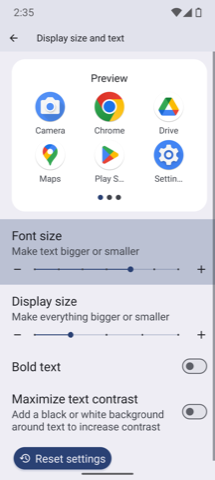
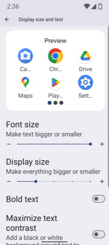
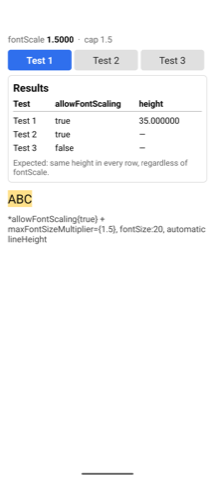
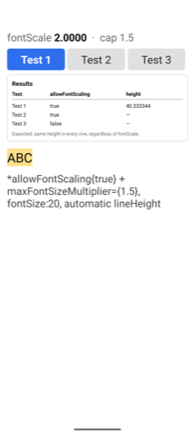
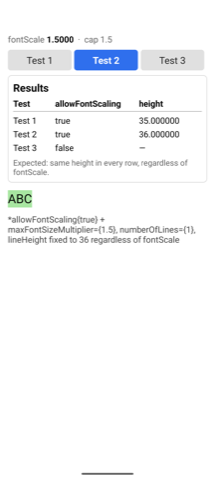
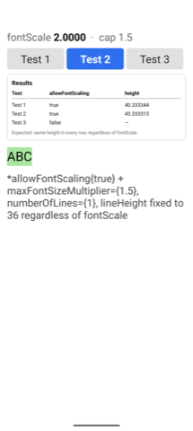
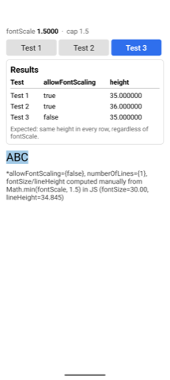
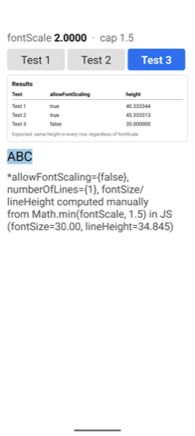

> [react native issue link](https://github.com/react/react-native/issues/58124)

## What this is

A minimal repro for a React Native bug on Android with the **New Architecture (Fabric)** enabled: `maxFontSizeMultiplier` correctly caps `fontSize`, but the rendered **line height / layout height** keeps growing with the device's raw system font scale, even when a value already capped in JS is passed explicitly.

[`src/App.tsx`](src/App.tsx) renders one screen with three switchable tabs (each test split out under [`src/components`](src/components)), plus a results table that records `PixelRatio.getFontScale()` and the measured `onLayout` height every time a tab is opened — so the discrepancy is visible on-device without a console attached:

- **Test 1** — `allowFontScaling` + `maxFontSizeMultiplier={1.5}`, automatic `lineHeight`.
- **Test 2** — same, but with an explicit `lineHeight` computed in JS so it's numerically identical (`36`) regardless of the device's font scale — isolates whether the leak is only in the _default_ line-height calculation.
- **Test 3** — the confirmed workaround: `allowFontScaling={false}` with `fontSize`/`lineHeight` computed manually from `Math.min(fontScale, cap)`.

### Where fontScale 1.5 / 2.0 come from

The original report came from a Samsung Galaxy S21 (One UI), whose accessibility font-size slider has 8 steps (`-2` to `+5`). The design requirement was to visually cap anything at `+4`/`+5` down to how `+3` looks. Measuring `PixelRatio.getFontScale()` at each step on that device gave:

| Device step | 0 (default) | +1   | +3  | +4  | +5  |
| ----------- | ----------- | ---- | --- | --- | --- |
| fontScale   | 1.0         | 1.15 | 1.5 | 1.7 | 2.0 |

So `1.5` and `2.0` in this repro aren't arbitrary test values — they're exactly what a Galaxy S21 reports at steps `+3` and `+5`. This repo's emulator (stock Android, Pixel 8 Pro) doesn't have Samsung's labeled `+3`/`+5` slider, so those two fontScale values were set directly via `adb shell settings put system font_scale <value>`. The screenshots below (Settings → Display → Display size and text → Font size) confirm that's a real OS-level accessibility setting and not just an internal-only value — the slider itself moves, and the preview app labels visibly grow and truncate between the two:

| Device Font size setting at fontScale = 1.5                                      | Device Font size setting at fontScale = 2.0                                      |
| -------------------------------------------------------------------------------- | -------------------------------------------------------------------------------- |
|  |  |

### Screenshots

`maxFontSizeMultiplier={1.5}` is the same in every screenshot below — only the device's actual system font scale differs (1.5 vs 2.0). Captured on an Android emulator (Pixel 8 Pro, API 35) via `adb shell settings put system font_scale <value>`, force-stopping and cold-starting the app between each change. The order below is deliberate: the problem first (Test 1, then Test 2), the workaround last (Test 3).

#### The problem — Test 1 (automatic `lineHeight`)

If the cap worked correctly, `height` should be identical in both columns. It isn't — it keeps growing with the device's raw font scale even though `maxFontSizeMultiplier={1.5}` is fixed the whole time (`35.0 → 40.33`):

| Device fontScale = 1.5                                               | Device fontScale = 2.0                                               |
| -------------------------------------------------------------------- | -------------------------------------------------------------------- |
|  |  |

#### The problem — Test 2 (explicit, pre-capped `lineHeight`)

This isolates whether Test 1's issue is just that the _default_ lineHeight calculation ignores the cap. Here `lineHeight` is computed in JS and passed as an explicit, fixed number (`36`) — numerically identical regardless of fontScale. If the native side only used the value it was given, both columns would match. Instead `height` still grows (`36.0 → 43.33`), which means the native layer is re-introducing the device's raw fontScale even on top of an already-capped value it was explicitly handed:

| Device fontScale = 1.5                                               | Device fontScale = 2.0                                               |
| -------------------------------------------------------------------- | -------------------------------------------------------------------- |
|  |  |

#### The workaround — Test 3 (`allowFontScaling={false}` + manual math)

Working around both of the above by turning `allowFontScaling` off entirely and computing `fontSize`/`lineHeight` manually from `Math.min(fontScale, cap)` in JS. This is the result of routing around the leak rather than fixing it — but it's what actually achieves the originally desired behavior: `height` stays fixed at `35.0` in both columns, regardless of the device's real font scale:

| Device fontScale = 1.5                                               | Device fontScale = 2.0                                               |
| -------------------------------------------------------------------- | -------------------------------------------------------------------- |
|  |  |
